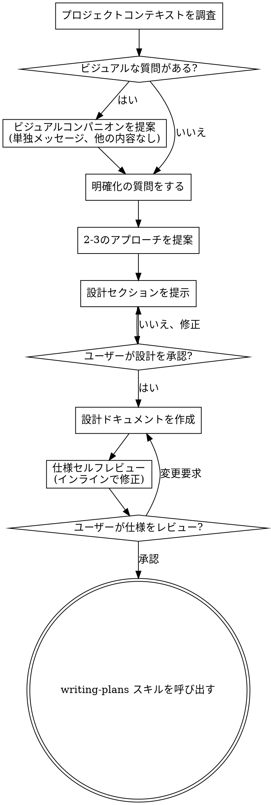

# アイデアを設計に仕上げるブレインストーミング

自然な対話を通じて、アイデアを完成された設計・仕様に変換する。

まず現在のプロジェクトコンテキストを把握し、その後一度に一つずつ質問してアイデアを洗練させる。何を構築するかを理解したら、設計を提示しユーザーの承認を得る。

<HARD-GATE>
設計を提示しユーザーが承認するまで、実装スキルの呼び出し、コードの記述、プロジェクトのスキャフォールディング、その他いかなる実装アクションも実行してはならない。これは、どんなに単純に見えるプロジェクトにも例外なく適用される。
</HARD-GATE>

## アンチパターン: 「これは設計が要らないほど単純だ」

すべてのプロジェクトがこのプロセスを経る。TODOリスト、単一関数のユーティリティ、設定変更 -- すべてだ。「単純な」プロジェクトこそ、検討されていない前提が最も多くの無駄な作業を生む。設計は短くてもよいが（本当に単純なプロジェクトなら数文で）、必ず提示して承認を得ること。

## チェックリスト

以下の各項目についてタスクを作成し、順番に完了すること:

1. **プロジェクトコンテキストを調査** -- ファイル、ドキュメント、最近のコミットを確認
2. **ビジュアルコンパニオンを提案**（トピックにビジュアルな質問が含まれる場合）-- これは単独のメッセージとし、明確化の質問と組み合わせない。下記のビジュアルコンパニオンセクションを参照。
3. **明確化の質問をする** -- 一度に一つずつ、目的・制約・成功基準を理解する
4. **2-3のアプローチを提案** -- トレードオフと推奨案を添えて
5. **設計を提示** -- 複雑さに応じたセクションに分けて、各セクションごとにユーザーの承認を得る
6. **設計ドキュメントを作成** -- `docs/superpowers/specs/YYYY-MM-DD-<topic>-design.md` に保存しコミット
7. **仕様セルフレビュー** -- プレースホルダー、矛盾、曖昧さ、スコープの簡易チェック（下記参照）
8. **ユーザーが書かれた仕様をレビュー** -- 進める前にユーザーに仕様ファイルのレビューを依頼
9. **実装へ移行** -- writing-plans スキルを呼び出して実装計画を作成

## プロセスフロー

**終了状態は writing-plans の呼び出しである。** frontend-design、mcp-builder、その他の実装スキルを呼び出してはならない。brainstorming の後に呼び出す唯一のスキルは writing-plans である。

## プロセス

**アイデアの理解:**

- まず現在のプロジェクト状態を確認する（ファイル、ドキュメント、最近のコミット）
- 詳細な質問をする前にスコープを評価する: リクエストが複数の独立したサブシステムを記述している場合（例:「チャット、ファイルストレージ、課金、アナリティクスを備えたプラットフォームを構築」）、これを直ちに指摘する。分解が必要なプロジェクトの詳細を詰める質問に時間を使わない。
- プロジェクトが単一の仕様には大きすぎる場合、ユーザーがサブプロジェクトに分解するのを助ける: 独立した部分は何か、それらはどう関連するか、どの順序で構築すべきか。その後、最初のサブプロジェクトを通常の設計フローでブレインストーミングする。各サブプロジェクトはそれぞれ独自の仕様 → 計画 → 実装サイクルを持つ。
- 適切なスコープのプロジェクトでは、一度に一つずつ質問してアイデアを洗練させる
- 可能な場合は選択式の質問を優先するが、自由回答でも構わない
- 1メッセージにつき1つの質問のみ -- トピックの探求が必要な場合は複数の質問に分ける
- 理解に集中する: 目的、制約、成功基準

**アプローチの探求:**

- トレードオフを添えて2-3の異なるアプローチを提案する
- 推奨案と理由を添えて、会話的に選択肢を提示する
- 推奨する選択肢を先頭に出し、その理由を説明する

**設計の提示:**

- 何を構築するか理解できたと確信したら、設計を提示する
- 各セクションの複雑さに応じてスケールさせる: 単純なら数文、微妙なニュアンスがあれば200-300語まで
- 各セクションの後に、ここまでで問題ないか確認する
- カバーする内容: アーキテクチャ、コンポーネント、データフロー、エラーハンドリング、テスト
- 何かわからない点があれば、戻って明確にする準備をする

**分離と明確性のための設計:**

- システムをより小さな単位に分割する。各単位は一つの明確な目的を持ち、明確に定義されたインターフェースを通じて通信し、独立して理解・テストできるようにする
- 各単位について、以下に答えられるべき: それは何をするのか、どう使うのか、何に依存しているのか
- 内部実装を読まずに単位が何をするか理解できるか? 利用者を壊さずに内部実装を変更できるか? できなければ、境界の見直しが必要。
- より小さく、境界が明確な単位は作業もしやすい -- コンテキストに一度に収まるコードについてより良く推論でき、ファイルが集中していると編集の信頼性が高まる。ファイルが大きくなったら、それはやりすぎのサインであることが多い。

**既存のコードベースでの作業:**

- 変更を提案する前に現在の構造を調査する。既存のパターンに従う。
- 既存のコードに作業に影響する問題がある場合（例: 大きくなりすぎたファイル、不明確な境界、絡み合った責任）、設計の一部として的を絞った改善を含める -- 優れた開発者が作業中のコードを改善するように。
- 無関係なリファクタリングは提案しない。現在の目標に役立つことに集中する。

## 設計の後

**ドキュメント:**

- 検証済みの設計（仕様）を `docs/superpowers/specs/YYYY-MM-DD-<topic>-design.md` に書き出す
  - （仕様の保存場所についてのユーザー設定がこのデフォルトを上書きする）
- elements-of-style:writing-clearly-and-concisely スキルが利用可能であれば使用する
- 設計ドキュメントを git にコミットする

**仕様セルフレビュー:**
仕様ドキュメントを書いた後、新鮮な目で見直す:

1. **プレースホルダーチェック:** 「TBD」「TODO」、未完成のセクション、曖昧な要件はないか? 修正する。
2. **内部一貫性:** セクション間で矛盾はないか? アーキテクチャは機能の説明と一致しているか?
3. **スコープチェック:** 単一の実装計画に十分な焦点が絞られているか、分解が必要か?
4. **曖昧性チェック:** 2通りに解釈できる要件はないか? あれば、一つを選んで明示する。

問題があればインラインで修正する。再レビューの必要はない -- 修正して先に進む。

**ユーザーレビューゲート:**
仕様レビューループが通過した後、進める前にユーザーに書かれた仕様のレビューを依頼する:

> 「仕様を作成し `<path>` にコミットしました。実装計画の作成に進む前に、変更したい箇所がないかご確認ください。」

ユーザーの応答を待つ。変更の要求があれば対応し、仕様レビューループを再実行する。ユーザーが承認した場合のみ進む。

**実装:**

- writing-plans スキルを呼び出して詳細な実装計画を作成する
- 他のスキルは呼び出さない。writing-plans が次のステップである。

## 主要な原則

- **一度に一つの質問** -- 複数の質問で圧倒しない
- **選択式を優先** -- 可能な場合、自由回答より答えやすい
- **YAGNI を徹底** -- すべての設計から不要な機能を削除
- **代替案を探求** -- 決定する前に必ず2-3のアプローチを提案
- **段階的な検証** -- 設計を提示し、先に進む前に承認を得る
- **柔軟に対応** -- 何かわからない場合は戻って明確にする

## ビジュアルコンパニオン

ブレインストーミング中にモックアップ、図、ビジュアルオプションを表示するためのブラウザベースのコンパニオン。モードではなくツールとして利用可能。コンパニオンを受け入れるということは、ビジュアルな扱いが有効な質問に使えるようになるということであり、すべての質問がブラウザを経由するわけではない。

**コンパニオンの提案:** 今後の質問にビジュアルコンテンツ（モックアップ、レイアウト、図）が含まれると予想される場合、同意を得るために一度だけ提案する:
> 「これから取り組む内容の一部は、Webブラウザで見せた方がわかりやすいかもしれません。進めながら、モックアップ、図、比較、その他のビジュアルを作成できます。この機能はまだ新しく、トークン消費が多くなる場合があります。試してみますか?（ローカルURLを開く必要があります）」

**この提案は必ず単独のメッセージにすること。** 明確化の質問、コンテキストの要約、その他のコンテンツと組み合わせてはならない。メッセージには上記の提案のみを含め、他には何も含めない。ユーザーの応答を待ってから続行する。辞退された場合は、テキストのみのブレインストーミングを続ける。

**質問ごとの判断:** ユーザーが受け入れた後も、各質問ごとにブラウザを使うかターミナルを使うか判断する。判断基準: **ユーザーはこれを読むより見た方が理解しやすいか?**

- **ブラウザを使う** -- コンテンツ自体がビジュアルである場合 -- モックアップ、ワイヤーフレーム、レイアウト比較、アーキテクチャ図、ビジュアルデザインの並列比較
- **ターミナルを使う** -- コンテンツがテキストである場合 -- 要件の質問、概念的な選択、トレードオフリスト、A/B/C/Dのテキスト選択肢、スコープの決定

UIトピックについての質問が自動的にビジュアルな質問になるわけではない。「この文脈でパーソナリティとはどういう意味ですか?」は概念的な質問 -- ターミナルを使う。「どのウィザードレイアウトが良いですか?」はビジュアルな質問 -- ブラウザを使う。

コンパニオンに同意した場合、続行する前に詳細なガイドを読む:
`skills/brainstorming/visual-companion.md`
