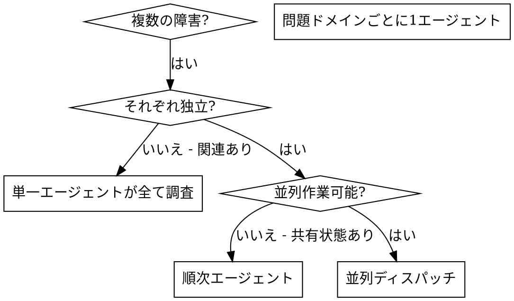

# 並列エージェントのディスパッチ

## 概要

あなたは専門的なエージェントに、隔離されたコンテキストでタスクを委任します。指示とコンテキストを正確に作成することで、エージェントがタスクに集中し成功することを保証します。エージェントはあなたのセッションのコンテキストや履歴を引き継ぐべきではありません — 必要なものだけを正確に構築します。これにより、あなた自身のコンテキストも調整作業のために保持されます。

複数の無関係な障害（異なるテストファイル、異なるサブシステム、異なるバグ）がある場合、順次調査するのは時間の無駄です。各調査は独立しており、並列に実行できます。

**基本原則:** 独立した問題ドメインごとに1つのエージェントをディスパッチする。並行して作業させる。

## 使用するタイミング



**使用する場合:**
- 3つ以上のテストファイルが異なる原因で失敗している
- 複数のサブシステムが独立して壊れている
- 各問題が他の問題のコンテキストなしで理解できる
- 調査間で共有状態がない

**使用しない場合:**
- 障害が関連している（1つ修正すれば他も直る可能性がある）
- システム全体の状態を理解する必要がある
- エージェント同士が干渉し合う

## パターン

### 1. 独立したドメインを特定する

障害を壊れているものごとにグループ化する:
- ファイル A のテスト: ツール承認フロー
- ファイル B のテスト: バッチ完了の動作
- ファイル C のテスト: 中止機能

各ドメインは独立している — ツール承認の修正は中止テストに影響しない。

### 2. 焦点を絞ったエージェントタスクを作成する

各エージェントに以下を与える:
- **具体的なスコープ:** 1つのテストファイルまたはサブシステム
- **明確なゴール:** これらのテストを通す
- **制約:** 他のコードを変更しない
- **期待する出力:** 発見事項と修正内容のサマリー

### 3. 並列にディスパッチする

```typescript
// Claude Code / AI 環境で
Task("agent-tool-abort.test.ts の失敗を修正")
Task("batch-completion-behavior.test.ts の失敗を修正")
Task("tool-approval-race-conditions.test.ts の失敗を修正")
// 3つすべてが並行して実行される
```

### 4. レビューと統合

エージェントが戻ったら:
- 各サマリーを読む
- 修正が競合しないことを確認する
- 全テストスイートを実行する
- すべての変更を統合する

## エージェントプロンプトの構造

良いエージェントプロンプトとは:
1. **焦点が絞られている** - 1つの明確な問題ドメイン
2. **自己完結している** - 問題を理解するために必要なすべてのコンテキストを含む
3. **出力が具体的** - エージェントは何を返すべきか?

```markdown
src/agents/agent-tool-abort.test.ts の失敗している3つのテストを修正してください:

1. "should abort tool with partial output capture" - メッセージに 'interrupted at' が期待される
2. "should handle mixed completed and aborted tools" - fast tool が completed ではなく aborted になる
3. "should properly track pendingToolCount" - 3つの結果が期待されるが0が返る

これらはタイミング/race condition の問題です。タスク:

1. テストファイルを読み、各テストが何を検証しているか理解する
2. 根本原因を特定する - タイミングの問題か実際のバグか?
3. 修正方法:
   - 任意のタイムアウトをイベントベースの待機に置き換える
   - 中止実装にバグがあれば修正する
   - 変更された動作をテストしている場合はテストの期待値を調整する

タイムアウトを増やすだけではなく、本当の問題を見つけること。

返却: 発見事項と修正内容のサマリー。
```

## よくある間違い

**❌ スコープが広すぎる:** "全テストを修正して" - エージェントが迷う
**✅ 具体的:** "agent-tool-abort.test.ts を修正して" - 焦点が絞られたスコープ

**❌ コンテキストなし:** "race condition を修正して" - エージェントがどこかわからない
**✅ コンテキストあり:** エラーメッセージとテスト名を貼り付ける

**❌ 制約なし:** エージェントが全体をリファクタリングするかもしれない
**✅ 制約あり:** "本番コードは変更しないこと" または "テストのみ修正"

**❌ 曖昧な出力:** "直して" - 何が変わったかわからない
**✅ 具体的:** "根本原因と変更内容のサマリーを返すこと"

## 使用してはいけない場合

**関連する障害:** 1つ修正すれば他も直る可能性がある - まず一緒に調査する
**完全なコンテキストが必要:** 理解にはシステム全体を見る必要がある
**探索的デバッグ:** 何が壊れているかまだわからない
**共有状態:** エージェントが干渉し合う（同じファイルを編集、同じリソースを使用）

## セッションからの実例

**シナリオ:** 大規模リファクタリング後に3つのファイルで6つのテスト失敗

**障害:**
- agent-tool-abort.test.ts: 3つの失敗（タイミングの問題）
- batch-completion-behavior.test.ts: 2つの失敗（ツールが実行されない）
- tool-approval-race-conditions.test.ts: 1つの失敗（実行回数 = 0）

**判断:** 独立したドメイン - 中止ロジックはバッチ完了とは別、race condition とも別

**ディスパッチ:**
```
Agent 1 → agent-tool-abort.test.ts を修正
Agent 2 → batch-completion-behavior.test.ts を修正
Agent 3 → tool-approval-race-conditions.test.ts を修正
```

**結果:**
- Agent 1: タイムアウトをイベントベースの待機に置き換え
- Agent 2: イベント構造のバグを修正（threadId の位置が間違い）
- Agent 3: 非同期ツール実行の完了待機を追加

**統合:** すべての修正が独立しており、競合なし、全スイートがグリーン

**節約できた時間:** 3つの問題を順次ではなく並列に解決

## 主なメリット

1. **並列化** - 複数の調査が同時に行われる
2. **集中** - 各エージェントが狭いスコープを持ち、追跡するコンテキストが少ない
3. **独立性** - エージェント同士が干渉しない
4. **速度** - 3つの問題を1つの時間で解決

## 検証

エージェントが戻った後:
1. **各サマリーをレビュー** - 何が変わったか理解する
2. **競合を確認** - エージェントが同じコードを編集していないか?
3. **全スイートを実行** - すべての修正が一緒に機能するか検証する
4. **スポットチェック** - エージェントは体系的なエラーを犯すことがある

## 実際のインパクト

デバッグセッション（2025-10-03）より:
- 3つのファイルで6つの失敗
- 3つのエージェントを並列にディスパッチ
- すべての調査が並行して完了
- すべての修正が正常に統合
- エージェントの変更間で競合ゼロ
