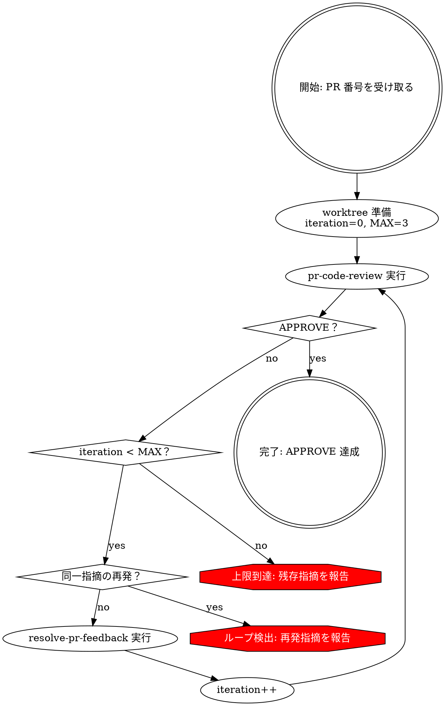

# 再帰的 PR レビュー & 修正ループ

pr-code-review → resolve-pr-feedback → 再レビューを APPROVE まで自動反復する。

**中核原則:** APPROVE になるまで止まらない。ただし安全弁として上限とループ検出を持つ。

**開始時に宣言:** "review-loop スキルを使って PR #{NUMBER} を再帰的にレビュー・修正します。(MAX={N}回)"

## 使用タイミング

**使うとき:**

- PR のレビュー→修正サイクルを自動で繰り返したいとき
- マージ前に指摘ゼロまで品質を上げたいとき

**使わないとき:**

- 1 回のレビューだけで十分 → `pr-code-review` 単体
- フィードバックの技術的正当性を評価したい → `receiving-code-review`
- 他人の PR をレビューするだけ → `pr-code-review` 単体

## プロセスフローチャート



## プロセス

### ステップ 0: 初期化

1. **worktree 準備** — `using-git-worktrees` で PR ブランチの worktree を作成（既存があれば再利用）
2. **パラメータ設定** — `iteration = 0`, `MAX = 3`（ユーザー指定があれば上書き）
3. **前回指摘の記録用リスト初期化** — `prev_findings = []`

```bash
BRANCH=$(gh pr view <NUMBER> --json headRefName --jq '.headRefName')
```

### ステップ 1: pr-code-review の実行

**REQUIRED SUB-SKILL:** `pr-code-review`

レビュー実行後、結果を記録:

```
current_findings = [(path, line, severity, summary), ...]
status = APPROVE | REQUEST_CHANGES | COMMENT
```

**判定:**

- `status == APPROVE` → **ステップ 4（完了）** へ
- それ以外 → 安全弁チェックへ

### ステップ 1.5: 安全弁チェック

**チェック 1 — 上限:**

```
iteration >= MAX → 上限到達処理へ
```

**チェック 2 — ループ検出（iteration > 0 の場合のみ）:**

`prev_findings` と `current_findings` を `(path, severity, summary のキーワード)` で比較。70% 以上が一致する場合、修正が機能していないと判断しループを中断。

```
overlap = |prev_findings ∩ current_findings| / |current_findings|
overlap >= 0.7 → ループ検出処理へ
```

両チェック通過 → **ステップ 2** へ。

### ステップ 2: resolve-pr-feedback の実行

**REQUIRED SUB-SKILL:** `resolve-pr-feedback`

- 全レビューコメントを取得し自律修正
- テスト・lint パス確認後プッシュ
- 各コメントに返信

完了後:

```
prev_findings = current_findings
iteration++
```

**ステップ 1** に戻る。

### ステップ 3: 異常終了処理

**上限到達の場合:**

```
## 上限到達レポート

PR: #{NUMBER}
イテレーション: {MAX} 回（上限）
最終ステータス: {status}

### 残存指摘
| severity | file:line | 概要 |
|----------|-----------|------|
| Important | src/foo.ts:42 | ... |

### 推奨アクション
- 人間パートナーが残存指摘を確認し判断
```

**ループ検出の場合:**

```
## ループ検出レポート

PR: #{NUMBER}
イテレーション: {iteration} 回目で中断
再発率: {overlap}%

### 再発指摘（修正が機能していない）
| severity | file:line | 概要 |
|----------|-----------|------|
| ... | ... | ... |

### 推奨アクション
- 再発指摘は設計判断または根本的な変更が必要な可能性
- 人間パートナーと方針を相談
```

### ステップ 4: 正常完了

```
## 再帰的レビュー完了

PR: #{NUMBER}
イテレーション: {iteration} 回
最終ステータス: APPROVE

### イテレーション履歴
| # | Critical | Important | Minor | ステータス |
|---|----------|-----------|-------|-----------|
| 1 | 3 | 5 | 2 | REQUEST_CHANGES |
| 2 | 0 | 1 | 1 | COMMENT |
| 3 | 0 | 0 | 0 | APPROVE |
```

## よくあるミス

| Mistake | Fix |
|---------|-----|
| 上限なしで実行 | MAX 必須（デフォルト 3） |
| 同一指摘のループ | ステップ 1.5 のループ検出で中断 |
| worktree なしで開始 | ステップ 0 必須 |
| 古いコメントを再修正 | resolve-pr-feedback の冪等性に任せる |
| iteration 記録を忘れる | 各ステップで findings と iteration を更新 |

## レッドフラグ

- 上限を設定せずに開始 → MAX = 3 を設定
- 同じエラーが 2 回出ているのにループ継続 → 中断して報告
- worktree なしで作業開始 → ステップ 0 に戻る
- APPROVE 前に「完了」と主張 → レビュー結果を確認
- resolve-pr-feedback のテストをスキップ → テストは必須

## 連携

**REQUIRED SUB-SKILL:**

- **pr-code-review** — 各イテレーションのレビュー実行
- **resolve-pr-feedback** — レビュー指摘の自律修正
- **using-git-worktrees** — PR ブランチの worktree 作成

**REQUIRED BACKGROUND:**

- **verification-before-completion** — 各イテレーションの修正検証
