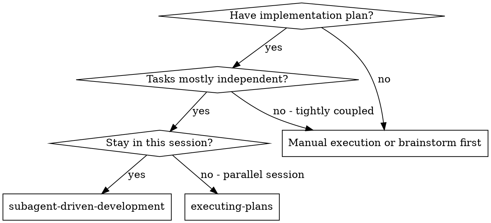
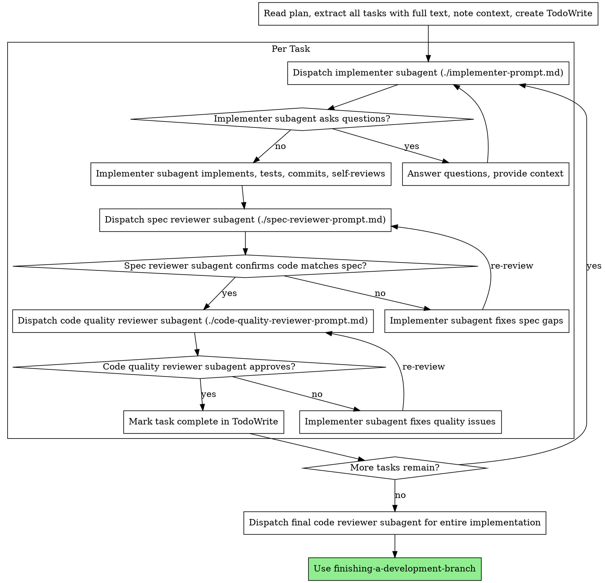

# Subagent-Driven Development

計画をタスクごとに新しいサブエージェントにディスパッチして実行する。各タスク完了後に2段階レビュー（仕様準拠レビュー → コード品質レビュー）を行う。

**サブエージェントを使う理由:** タスクを専門的なエージェントに委譲し、コンテキストを分離する。サブエージェントへの指示とコンテキストを正確に構成することで、タスクに集中して成功させる。サブエージェントはセッションのコンテキストや履歴を引き継がない。必要な情報だけを構成して渡す。これにより、自身のコンテキストも調整作業のために温存される。

**コア原則:** タスクごとに新しいサブエージェント + 2段階レビュー（仕様 → 品質）= 高品質・高速イテレーション

## いつ使うか



**executing-plans（並列セッション）との違い:**

- 同一セッション（コンテキストスイッチなし）
- タスクごとに新しいサブエージェント（コンテキスト汚染なし）
- 各タスク後に2段階レビュー：仕様準拠 → コード品質
- 高速イテレーション（タスク間に人の介入不要）

## プロセス



## モデル選択

コストを抑えスピードを上げるため、各ロールに対応できる最も軽量なモデルを使用する。

**機械的な実装タスク**（独立した関数、明確な仕様、1-2ファイル）: 高速・低コストなモデルを使用する。計画が十分に詳細であれば、ほとんどの実装タスクは機械的になる。

**統合・判断が必要なタスク**（複数ファイルの連携、パターンマッチング、デバッグ）: 標準モデルを使用する。

**アーキテクチャ・設計・レビュータスク**: 利用可能な最も高性能なモデルを使用する。

**タスク複雑度の判断基準:**

- 完全な仕様で1-2ファイルに触れる → 低コストモデル
- 統合上の懸念がある複数ファイル → 標準モデル
- 設計判断やコードベース全体の理解が必要 → 最高性能モデル

## 実装者ステータスの対応

実装者サブエージェントは4つのステータスのいずれかを報告する。それぞれ適切に対応すること。

**DONE:** 仕様準拠レビューに進む。

**DONE_WITH_CONCERNS:** 実装者は作業を完了したが懸念を報告した。進める前に懸念を確認する。正確性やスコープに関する懸念であれば、レビュー前に対応する。観察事項（例：「このファイルが大きくなってきた」）であれば、メモして先に進む。

**NEEDS_CONTEXT:** 実装者に提供されなかった情報が必要。不足しているコンテキストを提供し、再ディスパッチする。

**BLOCKED:** 実装者がタスクを完了できない。ブロッカーを評価する：

1. コンテキストの問題であれば、追加コンテキストを提供して同じモデルで再ディスパッチ
2. タスクにより高い推論力が必要であれば、より高性能なモデルで再ディスパッチ
3. タスクが大きすぎれば、より小さな単位に分割
4. 計画自体が間違っていれば、人間にエスカレーション

エスカレーションを**絶対に**無視したり、変更なしで同じモデルにリトライさせてはならない。実装者が行き詰まったと言ったら、何かを変える必要がある。

## プロンプトテンプレート

- `./implementer-prompt.md` - 実装者サブエージェントのディスパッチ
- `./spec-reviewer-prompt.md` - 仕様準拠レビュアーサブエージェントのディスパッチ
- `./code-quality-reviewer-prompt.md` - コード品質レビュアーサブエージェントのディスパッチ

## ワークフロー例

```
あなた: Subagent-Driven Development でこの計画を実行します。

[計画ファイルを1回読む: docs/superpowers/plans/feature-plan.md]
[5つのタスクすべてをフルテキストとコンテキスト付きで抽出]
[全タスクで TodoWrite を作成]

タスク 1: Hook インストールスクリプト

[タスク 1 のテキストとコンテキストを取得（抽出済み）]
[フルタスクテキスト + コンテキストで実装サブエージェントをディスパッチ]

実装者: 「始める前に確認です。Hook はユーザーレベルとシステムレベルのどちらにインストールしますか？」

あなた: 「ユーザーレベル（~/.config/superpowers/hooks/）」

実装者: 「了解しました。実装を開始します...」
[後で] 実装者:
  - install-hook コマンドを実装
  - テストを追加、5/5 パス
  - セルフレビュー: --force フラグが漏れていたので追加
  - コミット済み

[仕様準拠レビュアーをディスパッチ]
仕様レビュアー: ✅ 仕様準拠 - 全要件を満たしており、余分なものなし

[git SHA を取得、コード品質レビュアーをディスパッチ]
コードレビュアー: 長所: テストカバレッジ良好、クリーン。問題点: なし。承認。

[タスク 1 を完了としてマーク]

タスク 2: リカバリモード

[タスク 2 のテキストとコンテキストを取得（抽出済み）]
[フルタスクテキスト + コンテキストで実装サブエージェントをディスパッチ]

実装者: [質問なし、作業開始]
実装者:
  - verify/repair モードを追加
  - 8/8 テストパス
  - セルフレビュー: 問題なし
  - コミット済み

[仕様準拠レビュアーをディスパッチ]
仕様レビュアー: ❌ 問題あり:
  - 不足: 進捗レポート（仕様に「100件ごとにレポート」と記載）
  - 余分: --json フラグを追加（要求されていない）

[実装者が問題を修正]
実装者: --json フラグを削除、進捗レポートを追加

[仕様レビュアーが再レビュー]
仕様レビュアー: ✅ 仕様準拠

[コード品質レビュアーをディスパッチ]
コードレビュアー: 長所: 堅実。問題点（重要）: マジックナンバー（100）

[実装者が修正]
実装者: PROGRESS_INTERVAL 定数として抽出

[コードレビュアーが再レビュー]
コードレビュアー: ✅ 承認

[タスク 2 を完了としてマーク]

...

[全タスク完了後]
[最終コードレビュアーをディスパッチ]
最終レビュアー: 全要件を満たしており、マージ可能

完了！
```

## メリット

**手動実行と比較して:**

- サブエージェントは自然に TDD に従う
- タスクごとにフレッシュなコンテキスト（混乱なし）
- 並列安全（サブエージェント同士が干渉しない）
- サブエージェントが質問できる（作業前も作業中も）

**executing-plans と比較して:**

- 同一セッション（引き継ぎなし）
- 継続的な進捗（待ち時間なし）
- レビューチェックポイントが自動

**効率性の向上:**

- ファイル読み込みのオーバーヘッドなし（コントローラーがフルテキストを提供）
- コントローラーが必要なコンテキストを正確にキュレーション
- サブエージェントが最初から完全な情報を取得
- 質問が作業開始前に表面化（作業後ではなく）

**品質ゲート:**

- セルフレビューで引き継ぎ前に問題を検出
- 2段階レビュー: 仕様準拠 → コード品質
- レビューループで修正が実際に機能することを確認
- 仕様準拠レビューで過不足なく構築
- コード品質レビューで実装が適切に構築されていることを確認

**コスト:**

- サブエージェント呼び出しが増加（タスクごとに実装者 + レビュアー2名）
- コントローラーの準備作業が増加（全タスクを事前に抽出）
- レビューループでイテレーションが追加
- ただし問題を早期に検出（後からデバッグするより安価）

## レッドフラグ

**絶対にやってはいけないこと:**

- ユーザーの明示的な同意なしに main/master/dev ブランチで実装を開始する
- レビューをスキップする（仕様準拠またはコード品質のいずれか）
- 未修正の問題があるまま先に進む
- 複数の実装サブエージェントを並列でディスパッチする（コンフリクト）
- サブエージェントに計画ファイルを読ませる（代わりにフルテキストを提供）
- 場面設定のコンテキストをスキップする（サブエージェントはタスクの位置づけを理解する必要がある）
- サブエージェントの質問を無視する（作業を進める前に回答する）
- 仕様準拠で「だいたい合っている」を受け入れる（仕様レビュアーが問題を見つけた = 未完了）
- レビューループをスキップする（レビュアーが問題を見つけた = 実装者が修正 = 再レビュー）
- 実装者のセルフレビューを正式レビューの代わりにする（両方必要）
- **仕様準拠が ✅ になる前にコード品質レビューを開始する**（順番が違う）
- いずれかのレビューに未解決の問題がある状態で次のタスクに移る

**サブエージェントが質問した場合:**

- 明確かつ完全に回答する
- 必要に応じて追加コンテキストを提供する
- 実装を急がせない

**レビュアーが問題を見つけた場合:**

- 実装者（同じサブエージェント）が修正する
- レビュアーが再レビューする
- 承認されるまで繰り返す
- 再レビューをスキップしない

**サブエージェントがタスクに失敗した場合:**

- 具体的な指示で修正サブエージェントをディスパッチする
- 手動で修正しない（コンテキスト汚染）

## 連携

**必須ワークフロースキル:**

- **using-git-worktrees** - 必須: 開始前に分離されたワークスペースをセットアップ
- **writing-plans** - このスキルが実行する計画を作成する
- **requesting-code-review** - レビュアーサブエージェント用のコードレビューテンプレート
- **finishing-a-development-branch** - 全タスク完了後に開発を完了する

**サブエージェントが使用すべきスキル:**

- **test-driven-development** - サブエージェントは各タスクで TDD に従う

**代替ワークフロー:**

- **executing-plans** - 同一セッション実行の代わりに並列セッションで使用する
