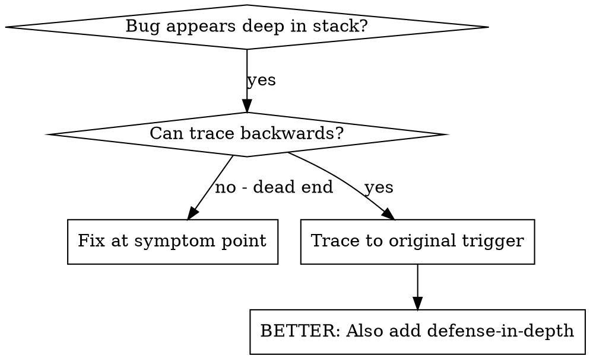
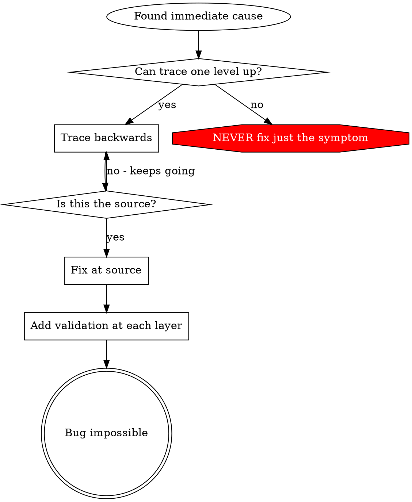

# Root Cause Tracing

## 概要

バグは call stack の深い位置で発現することが多い（git init が間違ったディレクトリで実行される、ファイルが間違った場所に作成される、データベースが間違ったパスで開かれるなど）。直感的にはエラーが発生した場所で修正したくなるが、それは症状を治療しているに過ぎない。

**基本原則:** call chain を逆方向にたどり、最初のトリガーを見つけてから、ソースで修正する。

## いつ使うか



**使用する場面:**
- エラーが実行の深い部分で発生する（エントリーポイントではない）
- stack trace が長い call chain を示している
- 不正なデータがどこで発生したか不明
- どのテスト/コードが問題を引き起こしているか特定する必要がある

## トレースのプロセス

### 1. 症状を観察する
```
Error: git init failed in /Users/jesse/project/packages/core
```

### 2. 直接的な原因を見つける
**どのコードが直接この問題を引き起こしているか？**
```typescript
await execFileAsync('git', ['init'], { cwd: projectDir });
```

### 3. 何がこれを呼び出したか？
```typescript
WorktreeManager.createSessionWorktree(projectDir, sessionId)
  → called by Session.initializeWorkspace()
  → called by Session.create()
  → called by test at Project.create()
```

### 4. さらに上方向にたどる
**どの値が渡されたか？**
- `projectDir = ''`（空文字列!）
- `cwd` が空文字列の場合、`process.cwd()` に解決される
- つまりソースコードのディレクトリ!

### 5. 最初のトリガーを見つける
**空文字列はどこから来たか？**
```typescript
const context = setupCoreTest(); // Returns { tempDir: '' }
Project.create('name', context.tempDir); // beforeEach の前にアクセス!
```

## Stack Trace の追加

手動でたどれない場合、計装を追加する:

```typescript
// 問題のある操作の前に
async function gitInit(directory: string) {
  const stack = new Error().stack;
  console.error('DEBUG git init:', {
    directory,
    cwd: process.cwd(),
    nodeEnv: process.env.NODE_ENV,
    stack,
  });

  await execFileAsync('git', ['init'], { cwd: directory });
}
```

**重要:** テストでは `console.error()` を使う（logger ではない - 表示されない場合がある）

**実行してキャプチャする:**
```bash
npm test 2>&1 | grep 'DEBUG git init'
```

**stack trace を分析する:**
- テストファイル名を探す
- 呼び出しをトリガーした行番号を見つける
- パターンを特定する（同じテスト？同じパラメータ？）

## どのテストが汚染を引き起こしているか特定する

テスト中に何かが発生するが、どのテストかわからない場合:

このディレクトリの bisection スクリプト `find-polluter.sh` を使用する:

```bash
./find-polluter.sh '.git' 'src/**/*.test.ts'
```

テストを一つずつ実行し、最初の汚染源で停止する。使い方はスクリプトを参照。

## 実例: 空の projectDir

**症状:** `packages/core/`（ソースコード）に `.git` が作成される

**トレースチェーン:**
1. `git init` が `process.cwd()` で実行される ← 空の cwd パラメータ
2. WorktreeManager が空の projectDir で呼び出される
3. Session.create() が空文字列を渡す
4. テストが beforeEach の前に `context.tempDir` にアクセス
5. setupCoreTest() は初期状態で `{ tempDir: '' }` を返す

**Root cause:** トップレベルの変数初期化が空の値にアクセス

**修正:** tempDir を getter にし、beforeEach の前にアクセスされた場合は throw するようにした

**defense-in-depth も追加:**
- Layer 1: Project.create() がディレクトリを検証
- Layer 2: WorkspaceManager が空でないことを検証
- Layer 3: NODE_ENV ガードが tmpdir 外での git init を拒否
- Layer 4: git init 前の stack trace ログ出力

## 基本原則



**エラーが表示された場所だけで修正してはならない。** 逆方向にたどって最初のトリガーを見つけること。

## Stack Trace のコツ

**テストでは:** `console.error()` を使う（logger ではない - 抑制される場合がある）
**操作の前に:** 危険な操作の前にログを出力する、失敗した後ではない
**コンテキストを含める:** ディレクトリ、cwd、環境変数、タイムスタンプ
**stack をキャプチャ:** `new Error().stack` で完全な call chain を表示

## 実際の効果

デバッグセッション（2025-10-03）からの実績:
- 5レベルのトレースで root cause を発見
- ソースで修正（getter バリデーション）
- 4レイヤーの defense を追加
- 1847テスト通過、汚染ゼロ
