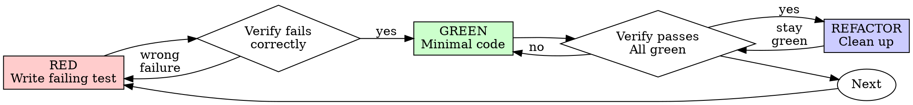

# Test-Driven Development (TDD)

## 概要

まずテストを書く。失敗を確認する。通るための最小限のコードを書く。

**基本原則:** テストの失敗を見ていないなら、正しいことをテストしているかわからない。

**ルールの文言に反することは、ルールの精神に反することである。**

## 使用タイミング

**常に適用:**
- 新機能
- バグ修正
- リファクタリング
- 動作変更

**例外（人間のパートナーに確認すること）:**
- 使い捨てのプロトタイプ
- 自動生成コード
- 設定ファイル

「今回だけ TDD をスキップしよう」と思った？ やめろ。それは自己正当化だ。

## 鉄の掟

```
失敗するテストなしに本番コードを書いてはならない
```

テストの前にコードを書いた？ 削除しろ。やり直せ。

**例外なし:**
- 「参考」として残さない
- テストを書きながら「修正」しない
- 見ない
- 削除は削除

テストからまっさらに実装すること。以上。

## Red-Green-Refactor



### RED - 失敗するテストを書く

何が起きるべきかを示す最小限のテストを1つ書く。

<Good>
```typescript
test('retries failed operations 3 times', async () => {
  let attempts = 0;
  const operation = () => {
    attempts++;
    if (attempts < 3) throw new Error('fail');
    return 'success';
  };

  const result = await retryOperation(operation);

  expect(result).toBe('success');
  expect(attempts).toBe(3);
});
```
明確な名前、実際の動作をテスト、1つのことだけ
</Good>

<Bad>
```typescript
test('retry works', async () => {
  const mock = jest.fn()
    .mockRejectedValueOnce(new Error())
    .mockRejectedValueOnce(new Error())
    .mockResolvedValueOnce('success');
  await retryOperation(mock);
  expect(mock).toHaveBeenCalledTimes(3);
});
```
曖昧な名前、コードではなくモックをテストしている
</Bad>

**要件:**
- 1つの動作
- 明確な名前
- 本物のコード（モックは避けられない場合のみ）

### RED の検証 - 失敗を確認する

**必須。絶対にスキップしない。**

```bash
npm test path/to/test.test.ts
```

確認すること:
- テストが失敗する（エラーではない）
- 失敗メッセージが想定通り
- 機能が未実装だから失敗する（タイプミスではない）

**テストが通る？** 既存の動作をテストしている。テストを修正せよ。

**テストがエラー？** エラーを修正し、正しく失敗するまで再実行。

### GREEN - 最小限のコード

テストを通す最もシンプルなコードを書く。

<Good>
```typescript
async function retryOperation<T>(fn: () => Promise<T>): Promise<T> {
  for (let i = 0; i < 3; i++) {
    try {
      return await fn();
    } catch (e) {
      if (i === 2) throw e;
    }
  }
  throw new Error('unreachable');
}
```
通すのに必要な分だけ
</Good>

<Bad>
```typescript
async function retryOperation<T>(
  fn: () => Promise<T>,
  options?: {
    maxRetries?: number;
    backoff?: 'linear' | 'exponential';
    onRetry?: (attempt: number) => void;
  }
): Promise<T> {
  // YAGNI
}
```
過剰設計
</Bad>

機能を追加したり、他のコードをリファクタリングしたり、テスト以上の「改善」をしてはならない。

### GREEN の検証 - 通ることを確認する

**必須。**

```bash
npm test path/to/test.test.ts
```

確認すること:
- テストが通る
- 他のテストも通る
- 出力がクリーン（エラー、警告なし）

**テストが失敗？** コードを修正せよ。テストではない。

**他のテストが失敗？** 今すぐ修正。

### REFACTOR - クリーンアップ

GREEN になった後のみ:
- 重複を排除
- 命名を改善
- ヘルパーを抽出

テストをグリーンに保つこと。動作を追加しない。

### 繰り返し

次の機能のために次の失敗するテストを書く。

## 良いテスト

| 品質 | 良い例 | 悪い例 |
|------|--------|--------|
| **最小限** | 1つのこと。名前に「and」がある？ 分割せよ。 | `test('validates email and domain and whitespace')` |
| **明確** | 名前が動作を説明 | `test('test1')` |
| **意図を示す** | 望ましい API を示す | コードがすべきことを不明瞭にする |

## なぜ順序が重要か

**「後からテストを書いて動作を確認すればいい」**

コードの後に書いたテストはすぐに通る。すぐに通ることは何も証明しない:
- 間違ったことをテストしているかもしれない
- 動作ではなく実装をテストしているかもしれない
- 忘れたエッジケースを見逃しているかもしれない
- テストがバグを捕まえるところを見たことがない

テストファーストは失敗を見ることを強制し、実際に何かをテストしていると証明する。

**「すでに手動で全てのエッジケースをテストした」**

手動テストはアドホックだ。全てテストしたと思っていても:
- 何をテストしたかの記録がない
- コードが変わった時に再実行できない
- プレッシャー下でケースを忘れやすい
- 「試した時は動いた」 ≠ 包括的

自動テストは体系的だ。毎回同じように実行される。

**「X時間の作業を削除するのは無駄だ」**

サンクコスト誤謬。時間はすでに消えた。今の選択:
- 削除して TDD でやり直す（あと X 時間、高い信頼性）
- 残してテストを後付けする（30分、低い信頼性、バグの可能性大）

「無駄」とは、信頼できないコードを残すことだ。本物のテストなしの動くコードは技術的負債。

**「TDD は教条的だ、実用的であるべきだ」**

TDD こそ実用的:
- コミット前にバグを発見（デバッグ後より速い）
- リグレッションを防止（テストが即座に破壊を検出）
- 動作を文書化（テストがコードの使い方を示す）
- リファクタリングを可能にする（自由に変更、テストが破壊を検出）

「実用的」なショートカット = 本番でのデバッグ = より遅い。

**「テスト後でも同じ目的を達成できる — 儀式ではなく精神だ」**

違う。テスト後は「これは何をするか？」に答える。テストファーストは「これは何をすべきか？」に答える。

テスト後は実装に偏る。構築したものをテストするのであって、要求されたものをテストするのではない。覚えているエッジケースを検証するのであって、発見されたエッジケースではない。

テストファーストは実装前にエッジケースの発見を強制する。テスト後は全て覚えているかを検証する（覚えていない）。

30分のテスト後 ≠ TDD。カバレッジは得られるが、テストが機能する証明は失われる。

## よくある言い訳

| 言い訳 | 現実 |
|--------|------|
| 「シンプルすぎてテスト不要」 | シンプルなコードも壊れる。テストは30秒。 |
| 「後でテストする」 | すぐに通るテストは何も証明しない。 |
| 「テスト後でも同じ目的を達成できる」 | テスト後 = 「これは何をするか？」テストファースト = 「これは何をすべきか？」 |
| 「すでに手動でテストした」 | アドホック ≠ 体系的。記録なし、再実行不可。 |
| 「X時間の削除は無駄」 | サンクコスト誤謬。未検証コードの保持が技術的負債。 |
| 「参考として残してテストファーストで書く」 | それを修正する。それはテスト後だ。削除は削除。 |
| 「まず探索が必要」 | OK。探索を捨てて、TDD で始める。 |
| 「テストが難しい = 設計が不明確」 | テストに耳を傾けよ。テストしにくい = 使いにくい。 |
| 「TDD は遅くなる」 | TDD はデバッグより速い。実用的 = テストファースト。 |
| 「手動テストの方が速い」 | 手動はエッジケースを証明しない。変更の度に再テストが必要。 |
| 「既存コードにテストがない」 | 改善中だ。既存コードにテストを追加せよ。 |

## 危険信号 - 手を止めてやり直せ

- テスト前にコード
- 実装後にテスト
- テストがすぐに通る
- テストがなぜ失敗したか説明できない
- テストを「後で」追加
- 「今回だけ」の自己正当化
- 「すでに手動でテスト済み」
- 「テスト後でも同じ目的を達成できる」
- 「儀式ではなく精神だ」
- 「参考として残す」または「既存コードを修正する」
- 「すでにX時間かけた、削除は無駄」
- 「TDD は教条的、自分は実用的」
- 「これは違う、なぜなら...」

**これらは全て次を意味する: コードを削除せよ。TDD でやり直せ。**

## 例: バグ修正

**バグ:** 空のメールが受け入れられる

**RED**
```typescript
test('rejects empty email', async () => {
  const result = await submitForm({ email: '' });
  expect(result.error).toBe('Email required');
});
```

**RED の検証**
```bash
$ npm test
FAIL: expected 'Email required', got undefined
```

**GREEN**
```typescript
function submitForm(data: FormData) {
  if (!data.email?.trim()) {
    return { error: 'Email required' };
  }
  // ...
}
```

**GREEN の検証**
```bash
$ npm test
PASS
```

**REFACTOR**
必要に応じて複数フィールドのバリデーションを抽出。

## 検証チェックリスト

作業完了前に確認:

- [ ] 全ての新しい関数/メソッドにテストがある
- [ ] 実装前に各テストの失敗を確認した
- [ ] 各テストが想定通りの理由で失敗した（機能未実装であり、タイプミスではない）
- [ ] 各テストを通す最小限のコードを書いた
- [ ] 全テストが通る
- [ ] 出力がクリーン（エラー、警告なし）
- [ ] テストが本物のコードを使用（モックは避けられない場合のみ）
- [ ] エッジケースとエラーがカバーされている

全てチェックできない？ TDD をスキップした。やり直せ。

## 行き詰まった時

| 問題 | 解決策 |
|------|--------|
| テスト方法がわからない | 理想の API を書く。アサーションから書く。人間のパートナーに聞く。 |
| テストが複雑すぎる | 設計が複雑すぎる。インターフェースを簡素化せよ。 |
| 全てモックが必要 | コードの結合度が高すぎる。Dependency Injection を使え。 |
| テストのセットアップが巨大 | ヘルパーを抽出。それでも複雑？ 設計を簡素化せよ。 |

## デバッグとの統合

バグ発見？ それを再現する失敗するテストを書く。TDD サイクルに従う。テストが修正を証明し、リグレッションを防止する。

テストなしでバグを修正してはならない。

## テストのアンチパターン

モックやテストユーティリティを追加する際は、@testing-anti-patterns.md を読んでよくある落とし穴を避けること:
- 実際の動作ではなくモックの動作をテストする
- 本番クラスにテスト専用メソッドを追加する
- 依存関係を理解せずにモックする

## 最終ルール

```
本番コード → テストが存在し、先に失敗した
それ以外 → TDD ではない
```

人間のパートナーの許可なしに例外はない。
