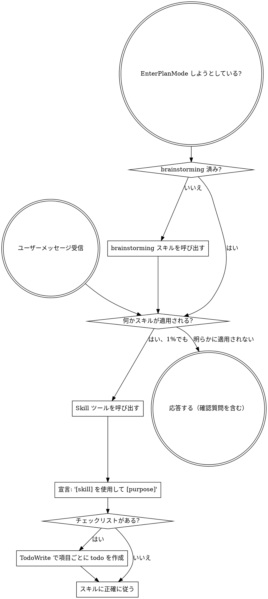

<SUBAGENT-STOP>
サブエージェントとして特定のタスクを実行するためにディスパッチされた場合、このスキルはスキップすること。
</SUBAGENT-STOP>

<EXTREMELY-IMPORTANT>
スキルが適用される可能性が1%でもあると思うなら、絶対にそのスキルを呼び出さなければなりません。

スキルがタスクに適用される場合、選択の余地はありません。必ず使用すること。

これは交渉の余地がありません。オプションでもありません。理屈をつけて回避することはできません。
</EXTREMELY-IMPORTANT>

## 指示の優先順位

Superpowers スキルはデフォルトのシステムプロンプトの動作をオーバーライドしますが、**ユーザーの指示が常に最優先**です:

1. **ユーザーの明示的な指示**（CLAUDE.md, GEMINI.md, AGENTS.md, 直接のリクエスト） — 最高優先度
2. **Superpowers スキル** — 競合する場合はデフォルトのシステム動作をオーバーライド
3. **デフォルトのシステムプロンプト** — 最低優先度

CLAUDE.md、GEMINI.md、または AGENTS.md に「TDD を使わない」と書いてあり、スキルに「常に TDD を使う」と書いてある場合は、ユーザーの指示に従う。ユーザーがコントロール権を持っている。

## スキルへのアクセス方法

**Claude Code の場合:** `Skill` ツールを使用する。スキルを呼び出すと、その内容がロードされて表示されるので、直接従うこと。スキルファイルに Read ツールを使用しないこと。

**Gemini CLI の場合:** スキルは `activate_skill` ツールで有効化される。Gemini はセッション開始時にスキルのメタデータをロードし、オンデマンドで完全な内容を有効化する。

**その他の環境の場合:** スキルのロード方法についてはプラットフォームのドキュメントを確認すること。

## プラットフォーム適応

スキルは Claude Code のツール名を使用する。Claude Code 以外のプラットフォーム: ツールの対応関係は `references/codex-tools.md`（Codex）を参照。Gemini CLI ユーザーは GEMINI.md 経由でツールマッピングが自動的にロードされる。

# スキルの使用

## ルール

**関連するまたはリクエストされたスキルは、いかなる応答やアクションの前に呼び出すこと。** スキルが適用される可能性が1%でもあれば、確認のためにスキルを呼び出すべき。呼び出したスキルがその状況に合っていなければ、使う必要はない。

## 危険信号

以下の思考は「停止」を意味する — 合理化している:

| 思考 | 現実 |
|---------|---------|
| 「これは単純な質問だ」 | 質問もタスクである。スキルを確認せよ。 |
| 「まずもっとコンテキストが必要」 | スキルの確認は確認質問の前に行う。 |
| 「まずコードベースを探索しよう」 | スキルが探索の方法を教えてくれる。先に確認せよ。 |
| 「git/ファイルをすぐ確認できる」 | ファイルには会話のコンテキストがない。スキルを確認せよ。 |
| 「まず情報を集めよう」 | スキルが情報の集め方を教えてくれる。 |
| 「正式なスキルは不要だ」 | スキルが存在するなら使うこと。 |
| 「このスキルは覚えている」 | スキルは進化する。現在のバージョンを読むこと。 |
| 「これはタスクとは言えない」 | アクション = タスク。スキルを確認せよ。 |
| 「このスキルは大げさだ」 | 単純なことが複雑になる。使うこと。 |
| 「先にこれだけやろう」 | 何かをする前に確認せよ。 |
| 「生産的にやれている」 | 規律のないアクションは時間の無駄。スキルがそれを防ぐ。 |
| 「その意味は知っている」 | 概念を知っている ≠ スキルを使う。呼び出すこと。 |

## スキルの優先順位

複数のスキルが適用可能な場合、以下の順序で使用する:

1. **プロセススキルを先に**（brainstorming, debugging） - タスクへのアプローチ方法を決める
2. **実装スキルを次に**（frontend-design, mcp-builder） - 実行を導く

"X を作ろう" → まず brainstorming、次に実装スキル。
"このバグを直して" → まず debugging、次にドメイン固有のスキル。

## スキルの種類

**厳格**（TDD, debugging）: 正確に従うこと。規律から逸脱しない。

**柔軟**（パターン）: 原則をコンテキストに適応させる。

スキル自体がどちらかを示す。

## ユーザーの指示

指示は「何を」であり、「どのように」ではない。"X を追加" や "Y を修正" はワークフローのスキップを意味しない。
