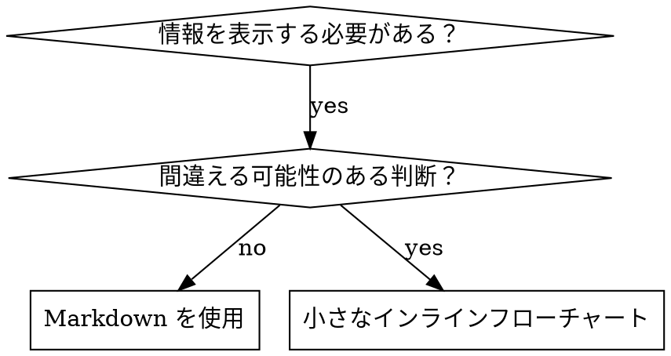

# スキルの作成

## 概要

**スキル作成は、プロセスドキュメントに適用したテスト駆動開発（TDD）そのものです。**

**個人のスキルはエージェント固有のディレクトリに配置します（Claude Code は `~/.claude/skills`、Codex は `~/.agents/skills/`）**

テストケース（subagent によるプレッシャーシナリオ）を書き、失敗を観察し（ベースライン動作）、スキル（ドキュメント）を書き、テスト合格を確認し（エージェントが従う）、リファクタリング（抜け穴をふさぐ）を行います。

**核心原則：** スキルなしでエージェントが失敗するのを確認しなければ、そのスキルが正しいことを教えているかわかりません。

**必須の前提知識：** このスキルを使う前に、test-driven-development を理解している必要があります。そのスキルが基本的な RED-GREEN-REFACTOR サイクルを定義しています。このスキルは TDD をドキュメント作成に適用するものです。

**公式ガイダンス：** Anthropic の公式スキル作成ベストプラクティスについては anthropic-best-practices.md を参照してください。このドキュメントは、TDD 重視のアプローチを補完する追加パターンとガイドラインを提供します。

## スキルとは？

**スキル**は、実証済みの技術、パターン、ツールのリファレンスガイドです。スキルは将来の Claude インスタンスが効果的なアプローチを見つけて適用するのに役立ちます。

**スキルである：** 再利用可能な技術、パターン、ツール、リファレンスガイド

**スキルではない：** 過去に問題を解決した方法のナラティブ

## TDD とスキル作成の対応関係

| TDD の概念               | スキル作成                                             |
| ------------------------ | ------------------------------------------------------ |
| **テストケース**         | subagent によるプレッシャーシナリオ                    |
| **プロダクションコード** | スキルドキュメント（SKILL.md）                         |
| **テスト失敗（RED）**    | スキルなしでエージェントがルールに違反（ベースライン） |
| **テスト合格（GREEN）**  | スキルがある状態でエージェントが従う                   |
| **Refactor**             | コンプライアンスを維持しながら抜け穴をふさぐ           |
| **テストを先に書く**     | スキルを書く前にベースラインシナリオを実行             |
| **失敗を確認する**       | エージェントが使う正確な合理化をドキュメント化         |
| **最小限のコード**       | 具体的な違反に対処するスキルを書く                     |
| **合格を確認する**       | エージェントが従うことを検証                           |
| **Refactor サイクル**    | 新たな合理化を発見 → 対策 → 再検証                     |

スキル作成プロセス全体が RED-GREEN-REFACTOR に従います。

## いつスキルを作成するか

**作成すべき場合：**

- その技術が直感的に明白でなかった
- プロジェクト横断で再び参照する可能性がある
- パターンが広く適用できる（プロジェクト固有でない）
- 他の人にも有益である

**作成しない場合：**

- 一回限りのソリューション
- 他で十分にドキュメント化されている標準的な手法
- プロジェクト固有の慣習（CLAUDE.md に書く）
- 機械的な制約（正規表現/バリデーションで強制できるなら自動化する - ドキュメントは判断が必要なケースに使う）

## スキルの種類

### Technique（テクニック）

手順に従う具体的な方法（condition-based-waiting、root-cause-tracing）

### Pattern（パターン）

問題の考え方（flatten-with-flags、test-invariants）

### Reference（リファレンス）

API ドキュメント、構文ガイド、ツールドキュメント（office docs）

## ディレクトリ構造

```
skills/
  skill-name/
    SKILL.md              # メインリファレンス（必須）
    supporting-file.*     # 必要な場合のみ
```

**フラットな名前空間** - すべてのスキルが1つの検索可能な名前空間に配置

**別ファイルにする場合：**

1. **大量のリファレンス**（100行以上） - API ドキュメント、包括的な構文
2. **再利用可能なツール** - スクリプト、ユーティリティ、テンプレート

**インラインに保つ場合：**

- 原則とコンセプト
- コードパターン（50行未満）
- その他すべて

## SKILL.md の構造

**Frontmatter（YAML）：**

- 2つの必須フィールド：`name` と `description`（[agentskills.io/specification](https://agentskills.io/specification) でサポートされるすべてのフィールドを参照）
- 合計最大1024文字
- `name`：文字、数字、ハイフンのみ使用（括弧や特殊文字は不可）
- `description`：三人称で、使用タイミングのみを記述（何をするかではない）
  - 「Use when...」で始めてトリガー条件に焦点を当てる
  - 具体的な症状、状況、コンテキストを含める
  - **スキルのプロセスやワークフローを要約しない**（理由は CSO セクションを参照）
  - 可能であれば500文字以内

```markdown
---
name: Skill-Name-With-Hyphens
description: Use when [具体的なトリガー条件と症状]
---

# スキル名

## 概要

これは何か？核心原則を1〜2文で。

## 使用タイミング

[判断が自明でない場合の小さなインラインフローチャート]

症状やユースケースの箇条書き
使わない方がよい場合

## コアパターン（テクニック/パターンの場合）

Before/After コード比較

## クイックリファレンス

一般的な操作をスキャンするためのテーブルまたは箇条書き

## 実装

シンプルなパターンはインラインコード
大量のリファレンスや再利用可能ツールはファイルへのリンク

## よくある間違い

何がうまくいかないか + 修正方法

## 実際の効果（任意）

具体的な結果
```

## Claude Search Optimization（CSO）

**発見性に重要：** 将来の Claude がスキルを見つけられる必要があります

### 1. 充実した Description フィールド

**目的：** Claude は description を読んで、与えられたタスクにどのスキルをロードするか判断します。「今このスキルを読むべきか？」に答えられるようにしましょう。

**形式：** 「Use when...」で始めてトリガー条件に焦点を当てる

**重要：Description = 使用タイミングであり、スキルの内容ではない**

description にはトリガー条件のみを記述します。スキルのプロセスやワークフローを要約しないでください。

**これが重要な理由：** テストで、description がスキルのワークフローを要約している場合、Claude が完全なスキル内容を読まずに description に従ってしまうことが判明しました。「タスク間にコードレビュー」と書いた description では、スキルのフローチャートが明確に2回のレビューを示しているにもかかわらず、Claude は1回のレビューしか行いませんでした。

description を「Use when executing implementation plans with independent tasks」（ワークフローの要約なし）に変更したところ、Claude はフローチャートを正しく読み、2段階レビュープロセスに従いました。

**罠：** ワークフローを要約する description は、Claude がとるショートカットを作ります。スキル本体は Claude がスキップするドキュメントになってしまいます。

```yaml
# BAD: ワークフローを要約 - Claude がスキルを読まずにこれに従う可能性
description: Use when executing plans - dispatches subagent per task with code review between tasks

# BAD: プロセスの詳細が多すぎる
description: Use for TDD - write test first, watch it fail, write minimal code, refactor

# GOOD: トリガー条件のみ、ワークフロー要約なし
description: Use when executing implementation plans with independent tasks in the current session

# GOOD: トリガー条件のみ
description: Use when implementing any feature or bugfix, before writing implementation code
```

**内容：**

- スキルが適用されることを示す具体的なトリガー、症状、状況を使用
- _問題_（race condition、不整合な動作）を記述し、_言語固有の症状_（setTimeout、sleep）は記述しない
- スキル自体が技術固有でない限り、トリガーは技術に依存しないようにする
- スキルが技術固有の場合は、トリガーで明示する
- 三人称で書く（system prompt に注入される）
- **スキルのプロセスやワークフローを要約しない**

```yaml
# BAD: 抽象的すぎる、曖昧、使用タイミングが含まれていない
description: For async testing

# BAD: 一人称
description: I can help you with async tests when they're flaky

# BAD: 技術に言及しているがスキルはそれに固有でない
description: Use when tests use setTimeout/sleep and are flaky

# GOOD: 「Use when」で始まり、問題を記述、ワークフローなし
description: Use when tests have race conditions, timing dependencies, or pass/fail inconsistently

# GOOD: 明示的なトリガーを持つ技術固有のスキル
description: Use when using React Router and handling authentication redirects
```

### 2. キーワードカバレッジ

Claude が検索するであろう単語を使用：

- エラーメッセージ：「Hook timed out」「ENOTEMPTY」「race condition」
- 症状：「flaky」「hanging」「zombie」「pollution」
- 同義語：「timeout/hang/freeze」「cleanup/teardown/afterEach」
- ツール：実際のコマンド、ライブラリ名、ファイルタイプ

### 3. 説明的な命名

**能動態、動詞先頭を使用：**

- `creating-skills` が良い（`skill-creation` ではなく）
- `condition-based-waiting` が良い（`async-test-helpers` ではなく）

### 4. トークン効率（重要）

**問題：** getting-started や頻繁に参照されるスキルはすべての会話にロードされます。すべてのトークンが重要です。

**目標語数：**

- getting-started ワークフロー：各150語未満
- 頻繁にロードされるスキル：合計200語未満
- その他のスキル：500語未満（それでも簡潔に）

**テクニック：**

**詳細はツールのヘルプに移動：**

```bash
# BAD: SKILL.md にすべてのフラグをドキュメント化
search-conversations supports --text, --both, --after DATE, --before DATE, --limit N

# GOOD: --help を参照
search-conversations supports multiple modes and filters. Run --help for details.
```

**相互参照を使用：**

```markdown
# BAD: ワークフローの詳細を繰り返す

When searching, dispatch subagent with template...
[20行の繰り返し指示]

# GOOD: 他のスキルを参照

Always use subagents (50-100x context savings). REQUIRED: Use [other-skill-name] for workflow.
```

**例を圧縮：**

```markdown
# BAD: 冗長な例（42語）

your human partner: "How did we handle authentication errors in React Router before?"
You: I'll search past conversations for React Router authentication patterns.
[Dispatch subagent with search query: "React Router authentication error handling 401"]

# GOOD: 最小限の例（20語）

Partner: "How did we handle auth errors in React Router?"
You: Searching...
[Dispatch subagent → synthesis]
```

**冗長性を排除：**

- 相互参照されたスキルにあることを繰り返さない
- コマンドから明白なことを説明しない
- 同じパターンの複数の例を含めない

**検証：**

```bash
wc -w skills/path/SKILL.md
# getting-started ワークフロー：各150語未満を目標
# その他頻繁にロードされるもの：合計200語未満を目標
```

**行うこと・コアインサイトで命名：**

- `condition-based-waiting` > `async-test-helpers`
- `using-skills`（`skill-usage` ではなく）
- `flatten-with-flags` > `data-structure-refactoring`
- `root-cause-tracing` > `debugging-techniques`

**動名詞（-ing）はプロセスに適している：**

- `creating-skills`、`testing-skills`、`debugging-with-logs`
- 能動的で、行っているアクションを描写する

### 4. 他のスキルの相互参照

**他のスキルを参照するドキュメントを書く場合：**

スキル名のみを使用し、明示的な要件マーカーを付ける：

- GOOD: `**REQUIRED SUB-SKILL:** Use test-driven-development`
- GOOD: `**REQUIRED BACKGROUND:** You MUST understand systematic-debugging`
- BAD: `See skills/testing/test-driven-development`（必須かどうか不明）
- BAD: `@skills/testing/test-driven-development/SKILL.md`（強制ロードでコンテキストを消費）

**@ リンクを使わない理由：** `@` 構文はファイルを即座に強制ロードし、必要になる前に200k以上のコンテキストを消費します。

## フローチャートの使用



**フローチャートを使う場合：**

- 自明でない判断ポイント
- 早期に止めてしまう可能性があるプロセスループ
- 「A と B のどちらを使うか」の判断

**フローチャートを使わない場合：**

- リファレンス資料 → テーブル、リスト
- コード例 → Markdown ブロック
- 線形的な手順 → 番号付きリスト
- 意味のないラベル（step1、helper2）

graphviz のスタイルルールは @graphviz-conventions.dot を参照してください。

**ヒューマンパートナーへの可視化：** このディレクトリの `render-graphs.js` を使って、スキルのフローチャートを SVG にレンダリングできます：

```bash
./render-graphs.js ../some-skill           # 各図を個別に
./render-graphs.js ../some-skill --combine # すべての図を1つの SVG に
```

## コード例

**1つの優れた例は多数の凡庸な例に勝る**

最も適切な言語を選択：

- テスト技術 → TypeScript/JavaScript
- システムデバッグ → Shell/Python
- データ処理 → Python

**良い例：**

- 完全で実行可能
- WHY を説明するコメント付き
- 実際のシナリオに基づく
- パターンを明確に示す
- 適応可能（汎用テンプレートではない）

**やらないこと：**

- 5つ以上の言語で実装
- 穴埋め式テンプレートの作成
- 不自然な例の作成

ポーティングは得意なので、1つの優れた例で十分です。

## ファイル構成

### 自己完結型スキル

```
defense-in-depth/
  SKILL.md    # すべてインライン
```

条件：すべてのコンテンツが収まり、大量のリファレンスが不要な場合

### 再利用可能ツール付きスキル

```
condition-based-waiting/
  SKILL.md    # 概要 + パターン
  example.ts  # 適応可能な動作するヘルパー
```

条件：ツールが再利用可能なコードであり、ナラティブではない場合

### 大量リファレンス付きスキル

```
pptx/
  SKILL.md       # 概要 + ワークフロー
  pptxgenjs.md   # 600行の API リファレンス
  ooxml.md       # 500行の XML 構造
  scripts/       # 実行可能ツール
```

条件：リファレンス資料がインラインには大きすぎる場合

## 鉄則（TDD と同じ）

```
失敗テストなしにスキルを書いてはならない
```

これは新規スキルにも既存スキルの編集にも適用されます。

テストせずにスキルを書いた？削除してやり直し。
テストせずにスキルを編集した？同じ違反です。

**例外なし：**

- 「シンプルな追加」でも
- 「セクションの追加だけ」でも
- 「ドキュメントの更新」でも
- テストしていない変更を「参考資料」として残さない
- テスト実行中に「適応」しない
- 削除は削除

**必須の前提知識：** test-driven-development スキルが、これがなぜ重要かを説明しています。同じ原則がドキュメントに適用されます。

## すべてのスキル種類のテスト

異なるスキル種類には異なるテストアプローチが必要です：

### 規律強制スキル（ルール/要件）

**例：** TDD、verification-before-completion、designing-before-coding

**テスト方法：**

- 学術的な質問：ルールを理解しているか？
- プレッシャーシナリオ：ストレス下で従うか？
- 複数のプレッシャーの組み合わせ：時間 + サンクコスト + 疲労
- 合理化を特定し、明示的な反論を追加

**成功基準：** 最大プレッシャー下でエージェントがルールに従う

### テクニックスキル（ハウツーガイド）

**例：** condition-based-waiting、root-cause-tracing、defensive-programming

**テスト方法：**

- 適用シナリオ：テクニックを正しく適用できるか？
- バリエーションシナリオ：エッジケースを処理できるか？
- 情報不足テスト：指示にギャップがないか？

**成功基準：** エージェントが新しいシナリオにテクニックを正しく適用できる

### パターンスキル（メンタルモデル）

**例：** reducing-complexity、information-hiding のコンセプト

**テスト方法：**

- 認識シナリオ：パターンが適用される場面を認識できるか？
- 適用シナリオ：メンタルモデルを使えるか？
- 反例：適用しない方がよい場面を知っているか？

**成功基準：** エージェントがパターンの適用タイミングと方法を正しく判断できる

### リファレンススキル（ドキュメント/API）

**例：** API ドキュメント、コマンドリファレンス、ライブラリガイド

**テスト方法：**

- 検索シナリオ：正しい情報を見つけられるか？
- 適用シナリオ：見つけた情報を正しく使えるか？
- ギャップテスト：一般的なユースケースがカバーされているか？

**成功基準：** エージェントがリファレンス情報を見つけて正しく適用できる

## テストをスキップする一般的な合理化

| 言い訳                       | 現実                                                                     |
| ---------------------------- | ------------------------------------------------------------------------ |
| 「スキルは明らかに明確」     | あなたにとって明確 ≠ 他のエージェントにとって明確。テストすること。      |
| 「単なるリファレンス」       | リファレンスにもギャップや不明確なセクションがある。検索をテスト。       |
| 「テストは過剰」             | テストしていないスキルには問題がある。常に。15分のテストで数時間を節約。 |
| 「問題が出たらテストする」   | 問題 = エージェントがスキルを使えない。デプロイ前にテスト。              |
| 「テストが面倒」             | テストは、本番でスキルの問題をデバッグするより面倒ではない。             |
| 「良いものだと確信している」 | 過信は問題を保証する。とにかくテスト。                                   |
| 「学術的レビューで十分」     | 読む ≠ 使う。適用シナリオをテスト。                                      |
| 「テストする時間がない」     | テストしていないスキルのデプロイは、後で修正にもっと時間がかかる。       |

**これらすべてが意味すること：デプロイ前にテスト。例外なし。**

## 合理化に対するスキルの防御

規律を強制するスキル（TDD など）は合理化に抵抗する必要があります。エージェントは賢く、プレッシャー下で抜け穴を見つけます。

**心理学的補足：** 説得技術がなぜ効果的かを理解することで、体系的に適用できるようになります。authority、commitment、scarcity、social proof、unity の原則に関する研究基盤（Cialdini, 2021; Meincke et al., 2025）については persuasion-principles.md を参照してください。

### すべての抜け穴を明示的に塞ぐ

ルールを述べるだけでなく、具体的な回避策を禁止する：

<Bad>
```markdown
Write code before test? Delete it.
```
</Bad>

<Good>
```markdown
Write code before test? Delete it. Start over.

**No exceptions:**

- Don't keep it as "reference"
- Don't "adapt" it while writing tests
- Don't look at it
- Delete means delete

````
</Good>

### 「趣旨 vs 文言」の議論に対処する

基礎原則を早い段階で追加：

```markdown
**ルールの文言に違反することは、ルールの趣旨に違反することです。**
````

これにより「趣旨に従っている」という合理化のクラス全体を遮断できます。

### 合理化テーブルを構築する

ベースラインテストから合理化を収集します（下記テストセクション参照）。エージェントが使うすべての言い訳をテーブルに記録：

```markdown
| 言い訳                             | 現実                                                       |
| ---------------------------------- | ---------------------------------------------------------- |
| 「テストするには単純すぎる」       | 単純なコードも壊れる。テストは30秒。                       |
| 「後でテストする」                 | すぐに通るテストは何も証明しない。                         |
| 「後からテストでも同じ目的を達成」 | 後テスト = 「これは何をする？」先テスト = 「何をすべき？」 |
```

### Red Flags リストを作成する

エージェントが合理化しているときに自己チェックしやすくする：

```markdown
## Red Flags - やめてやり直し

- テスト前にコード
- 「手動でテスト済み」
- 「後からテストでも同じ目的を達成」
- 「文言ではなく趣旨の問題」
- 「これは違う、なぜなら...」

**これらすべてが意味すること：コードを削除。TDD でやり直し。**
```

### 違反症状の CSO を更新する

description にルールに違反しそうなときの症状を追加：

```yaml
description: use when implementing any feature or bugfix, before writing implementation code
```

## スキルのための RED-GREEN-REFACTOR

TDD サイクルに従う：

### RED：失敗テストを書く（ベースライン）

スキルなしで subagent にプレッシャーシナリオを実行します。正確な動作をドキュメント化：

- どのような選択をしたか？
- どのような合理化を使ったか（そのまま引用）？
- どのプレッシャーが違反を引き起こしたか？

これは「テストの失敗を確認する」ことです - スキルを書く前にエージェントが自然に何をするかを見なければなりません。

### GREEN：最小限のスキルを書く

特定の合理化に対処するスキルを書きます。仮定のケースのために追加コンテンツを加えないでください。

同じシナリオをスキル付きで実行します。エージェントが従うはずです。

### REFACTOR：抜け穴を塞ぐ

エージェントが新たな合理化を見つけた？明示的な反論を追加。防弾になるまで再テスト。

**テスト方法論：** 完全なテスト方法論については @testing-skills-with-subagents.md を参照：

- プレッシャーシナリオの書き方
- プレッシャーの種類（時間、サンクコスト、権威、疲労）
- 体系的な穴の修正
- メタテスト技術

## アンチパターン

### ナラティブの例

「2025-10-03のセッションで、空の projectDir が原因で...」
**なぜ悪いか：** 具体的すぎて再利用不可能

### 多言語での希釈

example-js.js、example-py.py、example-go.go
**なぜ悪いか：** 品質が中途半端、メンテナンス負荷

### フローチャート内のコード

```dot
step1 [label="import fs"];
step2 [label="read file"];
```

**なぜ悪いか：** コピーペーストできない、読みにくい

### 汎用的なラベル

helper1、helper2、step3、pattern4
**なぜ悪いか：** ラベルには意味的な内容が必要

## 注意：次のスキルに移る前に

**スキルを書いた後は、必ず立ち止まってデプロイプロセスを完了してください。**

**やらないこと：**

- 各スキルをテストせずにバッチで複数スキルを作成
- 現在のスキルが検証される前に次のスキルに移動
- 「バッチの方が効率的」だからテストをスキップ

**以下のデプロイチェックリストは各スキルに対して必須です。**

テストしていないスキルのデプロイ = テストしていないコードのデプロイ。品質基準の違反です。

## スキル作成チェックリスト（TDD 適用）

**重要：以下のチェックリスト項目ごとに TodoWrite で todo を作成してください。**

**RED フェーズ - 失敗テストを書く：**

- [ ] プレッシャーシナリオの作成（規律スキルは3つ以上のプレッシャーの組み合わせ）
- [ ] スキルなしでシナリオ実行 - ベースライン動作をそのままドキュメント化
- [ ] 合理化/失敗のパターンを特定

**GREEN フェーズ - 最小限のスキルを書く：**

- [ ] 名前は文字、数字、ハイフンのみ使用（括弧/特殊文字不可）
- [ ] 必須の `name` と `description` フィールドを含む YAML frontmatter（最大1024文字；[仕様](https://agentskills.io/specification)参照）
- [ ] description は「Use when...」で始まり、具体的なトリガー/症状を含む
- [ ] description は三人称で記述
- [ ] 検索用キーワードを全体に配置（エラー、症状、ツール）
- [ ] 核心原則を含む明確な概要
- [ ] RED で特定した具体的なベースライン失敗に対処
- [ ] コードはインラインまたは別ファイルへのリンク
- [ ] 1つの優れた例（多言語ではない）
- [ ] スキル付きでシナリオ実行 - エージェントが従うことを検証

**REFACTOR フェーズ - 抜け穴を塞ぐ：**

- [ ] テストから新たな合理化を特定
- [ ] 明示的な反論を追加（規律スキルの場合）
- [ ] すべてのテストイテレーションから合理化テーブルを構築
- [ ] Red Flags リストを作成
- [ ] 防弾になるまで再テスト

**品質チェック：**

- [ ] 判断が自明でない場合のみ小さなフローチャート
- [ ] クイックリファレンステーブル
- [ ] よくある間違いセクション
- [ ] ナラティブなストーリーテリングなし
- [ ] サポートファイルはツールまたは大量リファレンスの場合のみ

**デプロイ：**

- [ ] スキルを git にコミットして fork にプッシュ（設定されている場合）
- [ ] PR での貢献を検討（広く有用な場合）

## 発見ワークフロー

将来の Claude がスキルを見つける方法：

1. **問題に遭遇**（「テストが不安定」）
2. **スキルを発見**（description がマッチ）
3. **概要をスキャン**（これは関連するか？）
4. **パターンを読む**（クイックリファレンステーブル）
5. **例をロード**（実装時のみ）

**このフローに最適化** - 検索可能な用語を早く、頻繁に配置。

## 結論

**スキル作成は、プロセスドキュメントの TDD そのものです。**

同じ鉄則：失敗テストなしにスキルなし。
同じサイクル：RED（ベースライン） → GREEN（スキル作成） → REFACTOR（抜け穴をふさぐ）。
同じメリット：品質向上、予想外の減少、防弾の結果。

コードに TDD を適用するなら、スキルにも適用しましょう。ドキュメントに適用される同じ規律です。
